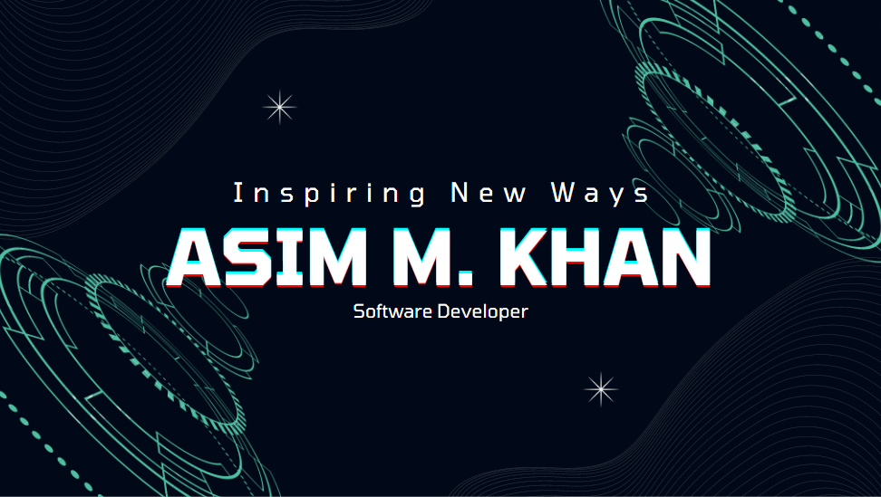

<h2>Hey there! I'm Asim Mehmood Khan</h2>

<!-- ## 👋 &nbsp;Hey there! I'm Aditya -->

### 👨🏻‍💻 &nbsp;About Me

💡 &nbsp;I am a Full Stack Web Developer | DevOps Engineer. Actively looking for a role in IT industry. I am from Lahore, Pakistan.\
🎓 &nbsp;I graduated from University of Portsmouth, UK in BSc.(Hons) In Computing and currently working with vTechBiz Solutions Lahore, Pakistan.\
🌱 &nbsp;I'm on track for learning more about Microsoft Azure DevOps, and AWS Solutions.\
✍️ &nbsp;In my free time, I spend time with my family and go on for long walks.\
💬 &nbsp;Feel free to reach out to me for projects, or just for some interesting discussion.\
✉️ &nbsp;You can reach me via email: asim.khan@vtechbiz.net I'll try to respond as soon as I can.\
📄 &nbsp;Please have a look at my [Résumé](https://docs.google.com/document/d/1IG4Yib4h1KzBrOTl1mNFL09ZaizljtUFJ_DBKBBVC-Y/edit?usp=sharing) for more details about me. I'm open to feedback and suggestions!

### 🛠 &nbsp;Tech Stack

&nbsp;
&nbsp;
&nbsp;
&nbsp;
\
&nbsp;
&nbsp;
&nbsp;
&nbsp;
&nbsp;

#### My Portfolio
[My Profile](https://asim-khan.netlify.app)

### 🤝🏻 &nbsp;Connect with Me

   

  

  

  

